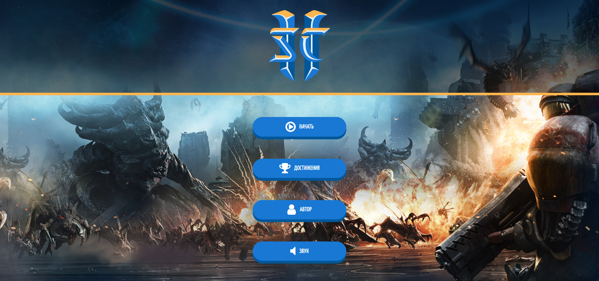
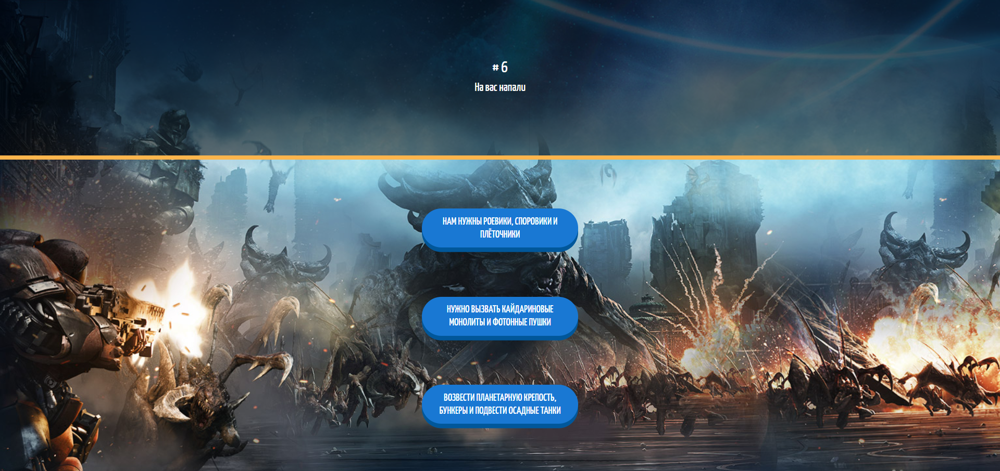
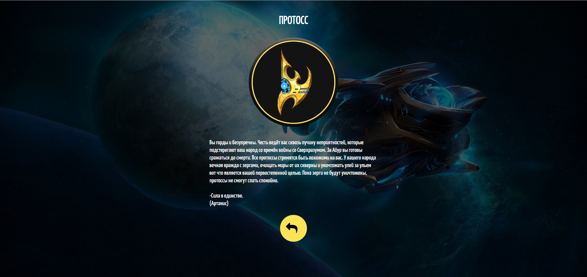
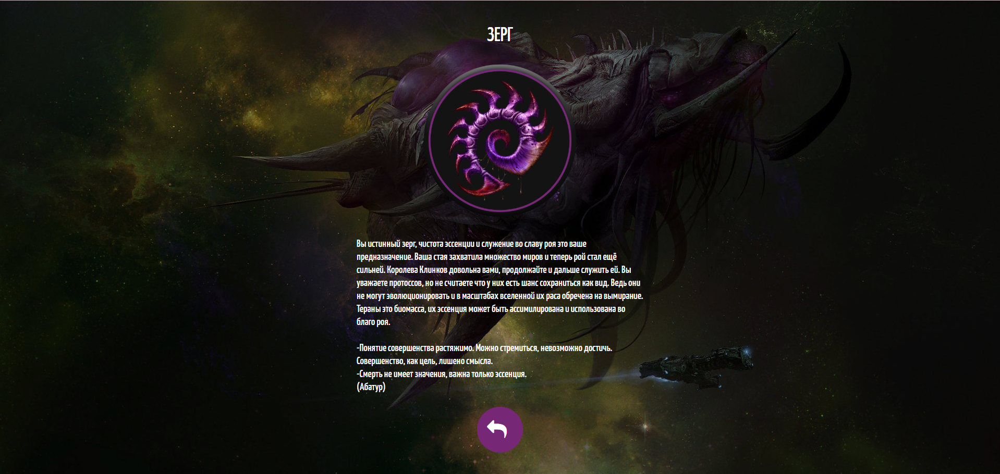
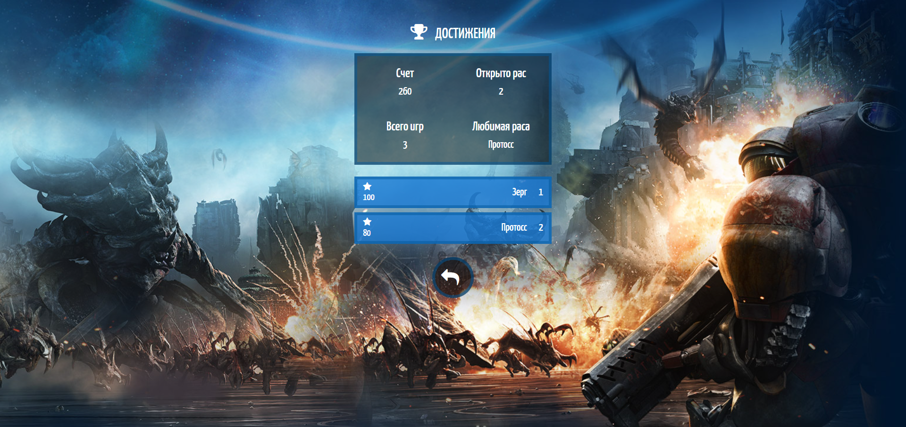

# 🎮 The Game "Who Are You in the Starcraft 2?"



<p align="center">
  <a href="https://github.com/elfototo/The-game-Who-are-you-in-the-Starcraft-2-" target="_blank">
    
  </a>
</p>

> **A fun and interactive game that helps you discover your role in the StarCraft 2 universe. Answer questions and find out which character you resemble!**

---

## 📚 Table of Contents
- [🎮 The Game "Who Are You in the Starcraft 2?"](#-the-game-who-are-you-in-the-starcraft-2)
  - [📚 Table of Contents](#-table-of-contents)
  - [🎯 General Project Description](#-general-project-description)
  - [⚙️ Tech Stack](#️-tech-stack)
  - [🚀 Installation Guide](#-installation-guide)
    - [Prerequisites](#prerequisites)
    - [Steps to get started](#steps-to-get-started)
  - [💡 Usage](#-usage)
  - [🌐 Live Demo](#-live-demo)
  - [📸 Screenshots](#-screenshots)

---

## 🎯 General Project Description

This project is an interactive game inspired by the **StarCraft 2** universe. It helps players discover which character they resemble based on a series of questions. The game uses **Vue.js** for building the frontend and other technologies to provide an immersive and fun experience.

**Main features:**
- Answer a series of questions about your personality and habits.
- Get a result that matches one of the iconic characters from the **StarCraft 2** universe.
- Designed as a fun way to connect the StarCraft 2 lore with personality types.

---

## ⚙️ Tech Stack


---

## 🚀 Installation Guide

### Prerequisites
Before you begin, ensure you have the following installed:
- **Node.js** version 14.x or higher (optional, if you want to make local changes or build).

### Steps to get started

1. **Clone the repository:**

    ```bash
    git clone https://github.com/elfototo/The-game-Who-are-you-in-the-Starcraft-2-.git
    cd The-game-Who-are-you-in-the-Starcraft-2-
    ```

2. **Install the dependencies (optional):**

    If you want to run the project locally and make changes, you can install the dependencies:

    ```bash
    npm install
    ```

3. **Run the project locally using Go Live (VS Code extension):**

    - If you're using **VS Code**, you can use the **Go Live** extension to start the project.
    - Simply open the project folder in **VS Code**, then click the **Go Live** button in the bottom-right corner. This will launch the application in your browser, and you'll be able to interact with the game.

    Alternatively, if you prefer not to use **VS Code**, you can serve the project locally using any static server, such as **http-server**.

    To install **http-server** (if you don't have it), you can run:

    ```bash
    npm install -g http-server
    ```

    ```bash
    http-server
    ```

---

## 💡 Usage

Once the application is running, the user can follow these steps:
1. **Start the game:** On the main page, click **"Start Game"** to begin answering questions.
2. **Answer questions:** You will be asked a series of questions related to your personality and gaming preferences.
3. **Discover your character:** After completing the quiz, you will be shown a character from the **StarCraft 2** universe that best matches your profile.

Enjoy playing and discovering which **StarCraft 2** character you are!

---

## 🌐 Live Demo

You can play the game directly online on [GitHub Pages](https://elfototo.github.io/The-game-Who-are-you-in-the-Starcraft-2-/).

## 📸 Screenshots

Here are some screenshots from the game:

|  |  |  |  |
|:------------------------------------------------:|:------------------------------------------------:|:------------------------------------------------:|:------------------------------------------------:|
| **Screenshot 1**: Answering questions                     | **Screenshot 2**: Result            | **Screenshot 3**: Result                  | **Screenshot 4**: achievements    |